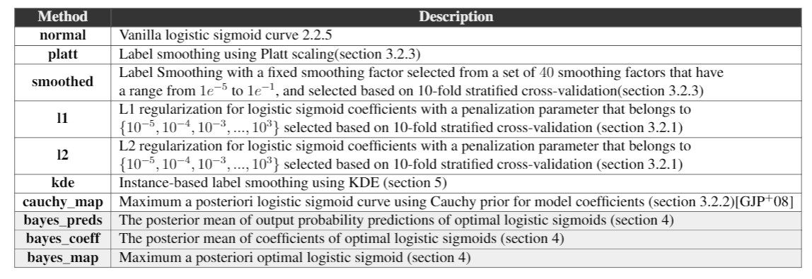
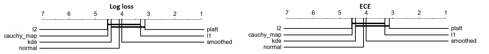
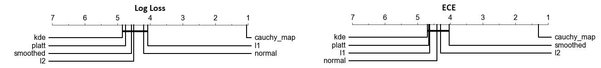

## For Instance-based label smoothing version in Neural Networks: Click[`HERE`](https://github.com/mmaher22/Instance-based-smoothing/tree/master/Instance-based%20Smoothing%20in%20Neural%20Networks)

# Instance-based Label Smoothing for Logistic Regression using Kernel Density Estimation

- This repository includes a new proposed method for instance-based label smoothing in Logistic regression based on Kernel density estimation by smoothing the labels of the more confident instances without introducing any additional noise to the labels of less confident ones will avoid overconfidence in all instances.
- Additionally, the implementation of the Bayesian approach of finding the optimal model predictions in case of prior knowledge of data generative model distribution.

- Besides, the repository includes Python Implementation of different logistic regression fitting approaches including Bayesian Logistic Regression using Cauchy priors for the model coefficients, L1/L2 regularization, and label smoothing using Platt scaling as shown in the table below.

<div style="text-align: center">

</div>

## Requirements
- Python 3.x
- pandas
- numpy
- scipy

## Usage

### Datasets
- 40 open-source datasets from [`OpenML`](https://www.openml.org/) and uploaded in the repository ```\Datasets``` folder.
        
### Files Content
The project have a structure as below:

```bash
├── BayesianCoeffLogisticRegression.py
├── BayesianDataLogisticRegression.py
├── CustomLogisticRegression.py
├── KDELogisticRegression.py
├── DatasetGenerator.py
├── Datasets
│   ├── aecoli.csv
│   ├── balloon.csv
│   ├── ...
```
`BayesianCoeffLogisticRegression.py` is the implementation class for training the Bayesian logistic regression with a cauchy prior for the model coefficients [`Gelman et al., 2008`](http://www.stat.columbia.edu/~gelman/research/published/priors11.pdf). <br>
`CustomLogisticRegression.py` is the implementation class for vanilla logistic regression, with Platt scaling label smoothing, with custom label smoothing factor or with L1/L2 regularization for logistic regression coefficients. <br>
`KDELogisticRegression.py` is the implementation class for logistic regression with instance-based label smoothing using kernel density estimation. <br>
`BayesianDataLogisticRegression.py` is the implementation class for the derived Bayesian approach of the optimal probability predictions for a dataset with a known generative model distribution (can be used with synthetic univariate datasets only). <br>
`DatasetGenerator.py` class for the synthetic datasets generation. <br>
`Datasets/` includes all real-world datasets used in the evaluation experiments.<br>

### Examples:
#### Bayesian Logistic Regression:
<details><summary>Open Example</summary>
<p>
        
```BayesianCoeffLogisticRegression.py```
        
```python
model = BayesianCoeffLogisticRegression()
model.fit(X_train, y_train)
y_pred = model.predict(X_test) #predicted labels
y_pred_proba = model.predict_proba(X_test) # predicted probabilities
ece, loss = model.predict_ece_logloss(X_test) #calibration error, log loss
```
</p>
</details>


#### Custom Logistic Regression:
<details><summary>Open Example</summary>
<p>
 
```CustomLogisticRegression.py``` 

```python
model = CustomLogisticRegression(
smoothing_factor_pos = 0, #smoothing factor of positive class instances
smoothing_factor_neg = 0, #smoothing factor of negative class instances
tolerance = 1e-3, #tolerance parameter (when to stop fitting logistic regression coefficients)
regularization = 'none', # use regularization or not ('none', 'l1', 'l2')
regularization_strength = 0, #regularization penalty parameter
platt_scaling = False) #use Platt scaling for label smoothing or not
model.fit(X_train, y_train)
y_pred = model.predict(X_test) #predicted labels
y_pred_proba = model.predict_proba(X_test) # predicted probabilities
ece, loss = model.predict_ece_logloss(X_test) #calibration error, log loss
```
</p>
</details>

#### Instance-based label smoothing Logistic Regression:
<details><summary>Open Example</summary>
<p>
 
```KDELogisticRegression.py``` 

```python
model = KDELogisticRegression()
model.fit(X_train, y_train)
y_pred = model.predict(X_test) #predicted labels
y_pred_proba = model.predict_proba(X_test) # predicted probabilities
ece, loss = model.predict_ece_logloss(X_test) #calibration error, log loss
```
</p>
</details>

#### BayesianData Logistic Regression:
<details><summary>Open Example</summary>
<p>

```BayesianDataLogisticRegression.py```

```python 
##### Posterior Mean of Probability Predictions  #####
prior_object = uniform_prior(l0min = a0, l0max = b0, l1min = a1, l1max = b1, lsmin=sigma, lsmax=sigma) #dataset generative model of uniform distribution with parameters l0min, l0max for negative class mean | l1min, l1max for positive class mean | lsmin, lsmax for stddev
clf_bayes_preds = BayesianDataLogisticRegressionMeanPreds(prior_object, #object of dataset generative model distribution
prior_type = 'uniform', #type of prior distribution of dataset generative model
prior_samples = 10000) #how many samples to draw from generative model distribution to approximate the posterior probability of optimal logistic regression model
clf_bayes_preds.fit(X_train, y_train)
##### Posterior Mean of Logistic Regression Coefficients #####
clf_bayes_coeffs = BayesianDataLogisticRegressionMeanCoeffs(prior_object, prior_type = 'uniform', prior_samples = 10000)
clf_bayes_coeffs.fit(X_train, y_train)
##### Logistic Regression Model with Highest Posterior Probability  #####
clf_bayes_map = BayesianDataLogisticRegressionMAP(prior_object, prior_type = prior_type, prior_samples = prior_samples)
clf_bayes_map.fit(X_train, y_train)

y_pred = clf_bayes_preds.predict(X_test) #predicted labels
y_pred_proba = clf_bayes_coeffs.predict_proba(X_test) # predicted probabilities
ece, loss = clf_bayes_map.predict_ece_logloss(X_test) #calibration error, log loss
```
</p>
</details>

## Results
- Critical Difference diagram of the evaluated methods on real datasets in terms of log loss and expected calibration error can be found below:

Logistic Regression performance when fitting on whole real-world datasets (Higher rank is better).
<div style="text-align: center">

</div>

Logistic Calibration performance of Linear SVM scores on real-world datasets (Higher rank is better).
<div style="text-align: center">

</div>

- For the synthetic datasets results, review the thesis text.
